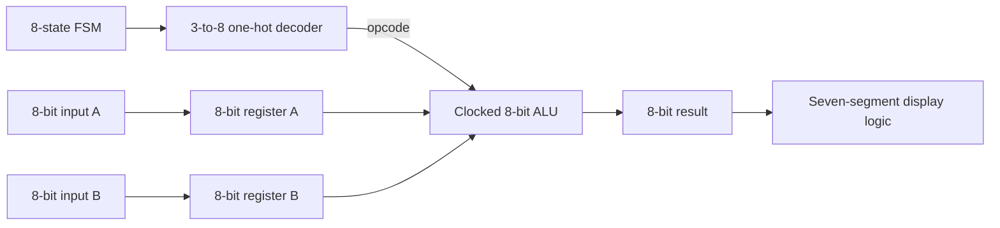

# 8-Bit VHDL CPU Architecture

An educational 8-bit CPU-style datapath and control project written in VHDL for the Altera/Intel Cyclone II FPGA. The design was developed in Quartus II and is organized as three progressive lab parts covering registers, finite-state control, opcode decoding, arithmetic/logic operations, seven-segment output, and parity checking.

> This is a compact teaching architecture rather than a complete stored-program processor: it demonstrates the core datapath and control building blocks but does not include instruction memory, a program counter, or a general-purpose register file.

## Architecture



The finite-state machine supplies a 3-bit state, the decoder converts it to a one-hot 8-bit opcode, and the selected ALU operation is captured on a clock edge. The result is split into upper and lower nibbles for display.

## Project stages

### Part A — Core datapath

Part A integrates two input registers, an eight-state FSM, a 3-to-8 opcode decoder, an 8-bit ALU, and seven-segment display drivers in the `partA.bdf` top-level schematic.

| One-hot opcode | Operation |
| --- | --- |
| `00000001` (`0x01`) | `A + B` |
| `00000010` (`0x02`) | `A - B` |
| `00000100` (`0x04`) | `NOT A` |
| `00001000` (`0x08`) | `NOT (A AND B)` — NAND |
| `00010000` (`0x10`) | `NOT (A OR B)` — NOR |
| `00100000` (`0x20`) | `A AND B` |
| `01000000` (`0x40`) | `A XOR B` |
| `10000000` (`0x80`) | `A OR B` |

### Part B — Alternate instruction set and hierarchical decoder

Part B explores a second clocked ALU and builds a 3-to-8 decoder from two 2-to-4 decoder blocks.

| One-hot opcode | RTL behavior |
| --- | --- |
| `0x01` | Signed `A - B` |
| `0x02` | Two's complement of `B` |
| `0x04` | Upper nibble of `A` joined with lower nibble of `B` |
| `0x08` | Hold the previous result |
| `0x10` | Signed `B - 5` |
| `0x20` | Reverse the bit order of `A` |
| `0x40` | `A(4 downto 0) & "111"` |
| `0x80` | Signed `A + 3` |

The source comment calls opcode `0x40` a right shift, but the table above records the exact implemented concatenation so that the behavior is unambiguous.

### Part C — Parity-checking extension

Part C combines the FSM, decoder, registers, and display logic with `ALU3`. Opcode `0x01` checks odd parity across the 4-bit `student_id` input and selects the project's encoded Y/N display result.

## Repository layout

```text
PartA/     Complete core datapath Quartus project and waveform
PartB/     Alternate ALU, decoder exercises, and component waveforms
PartC/     Parity-checking extension and complete top-level schematic
reports/   Small archived synthesis, fitting, and timing summaries
```

The original Quartus database caches, temporary backups, generated simulation netlists, and large programming outputs are intentionally excluded. Quartus regenerates them from the checked-in source and project files.

## Requirements

- Quartus II 13.0 SP1 or a compatible Intel Quartus installation
- Cyclone II device support
- Target device: `EP2C35F672C6`
- Optional: an FPGA development board using that device and the pin assignments in `PartA/partA.qsf`

## Open and build

1. Open the desired `.qpf` file in Quartus:
   - `PartA/partA.qpf`
   - `PartB/PartB.qpf`
   - `PartC/PartC.qpf`
2. Confirm the target device is `EP2C35F672C6`.
3. Confirm the top-level entity:
   - Part A: `partA`
   - Part B: `ALU2`
   - Part C: `PartC`
4. Run **Processing → Start Compilation**.
5. Open the included `.vwf` waveform files in the University Program VWF simulator to reproduce or extend the functional tests.

If the installed Quartus version upgrades the project, save the converted files in a new branch or copy so the original Quartus II 13.0 project remains available.

## Archived build results

All three supplied revisions completed synthesis and fitting successfully in Quartus II 13.0.1 SP1.

| Revision | Top level | Logic elements | Registers | Pins |
| --- | --- | ---: | ---: | ---: |
| Part A | `partA` | 10 | 9 | 69 |
| Part B | `ALU2` | 65 | 8 | 44 |
| Part C | `PartC` | 15 | 10 | 33 |

The archived TimeQuest summaries contain negative setup and minimum-pulse-width slack. Treat this as a functional lab implementation, review the clock constraints, and close timing before using it in a timing-critical hardware design.

## Implementation notes

- The register and ALU modules use active-low reset inputs, while the FSM uses an active-high reset. Preserve the intended schematic wiring and polarity when integrating the blocks.
- The ALUs are clocked: outputs update on the rising edge rather than changing combinationally with the inputs.
- Arithmetic uses 8-bit wraparound; there is no separate carry, borrow, or saturation output in the VHDL ALU entities.
- Part A includes board pin assignments. Parts B and C primarily preserve the functional project configuration and may require board-specific assignments before programming hardware.

## Verification assets

The repository keeps the original Quartus Vector Waveform Files (`.vwf`) for the integrated designs and individual Part B components. The concise reports in `reports/` preserve the successful fitter/resource results and the original timing summaries without committing generated build databases.

